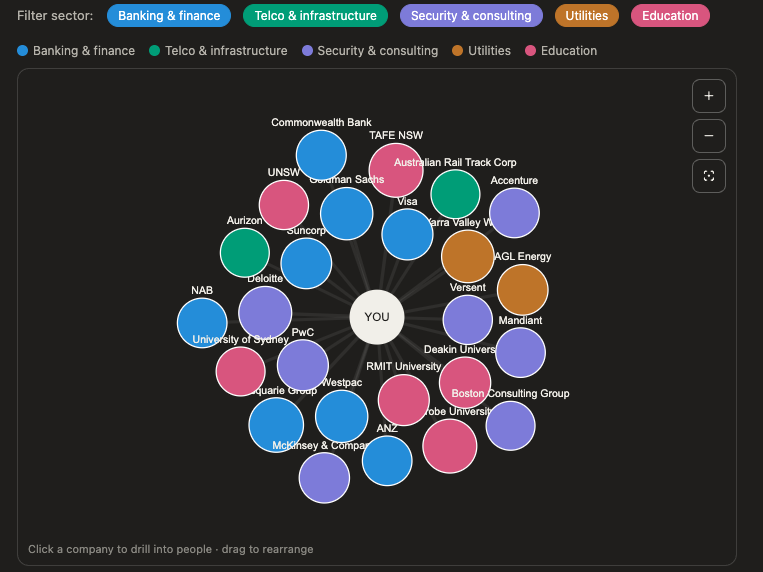

# AI LinkedIn Analyzer

Turns a LinkedIn data export into an interactive network dashboard — a force-directed
map of your connections clustered by company and coloured by industry sector, with
drill-down into the individuals at each organisation.



## Features

- **Force-directed network graph** — you at the centre, top companies as nodes sized
  by connection count and coloured by sector.
- **Sector filter** — toggle industry sectors on/off (banking, telco, security &
  consulting, cloud & tech, utilities, education).
- **Invitation-flow overlay** — highlights nodes when reviewing pending invitations.
- **Drill-down** — click any company to see a per-company role breakdown and a table
  of every individual you're connected with there. Names link to their LinkedIn
  profiles.
- **Zoom / pan / reset** controls.
- **Connection analysis** CLI — totals, growth by year, top companies, role mix.

Everything is static — open `dashboard/index.html` in a browser, no server required.

## Usage

1. Request your data archive from LinkedIn
   (Settings → Data privacy → Get a copy of your data) and unzip it.

2. Run the analysis (prints a text summary):

   ```bash
   python scripts/analyze_connections.py /path/to/linkedin_export
   ```

3. Build the dashboard (regenerates `data/company_people.json` and
   `dashboard/index.html` with your data embedded):

   ```bash
   python scripts/build_dashboard.py /path/to/linkedin_export
   ```

4. Open `dashboard/index.html`.

No dependencies beyond the Python standard library. D3 and the Tabler icon font are
loaded from CDN at runtime.

## Layout

```
scripts/analyze_connections.py   Text connection analysis
scripts/build_dashboard.py       Extracts per-company people, renders the dashboard
scripts/dashboard_template.html  HTML/JS template (PEOPLE data injected at build)
data/company_people.json         Extracted dataset (regenerated by the build)
dashboard/index.html             Generated standalone dashboard
```

## Local development

Place your unzipped LinkedIn export in a `linkedin_export/` directory at the repo
root — this path is git-ignored, so your real data never gets committed. The build
and analysis scripts then run against it directly:

```bash
python scripts/build_dashboard.py ./linkedin_export      # rebuild dashboard
python scripts/analyze_connections.py ./linkedin_export  # text analysis
open dashboard/index.html                                # view it
```

Only the derived artifacts (`dashboard/index.html`, `data/company_people.json`) are
tracked. Rebuilding from the same export is deterministic — it produces no diff.

## Privacy

The dashboard embeds real names, job titles and LinkedIn profile URLs from your
connections. Keep this repository **private** unless you have replaced the data with
an anonymised sample. Raw LinkedIn exports are git-ignored by default.

## License

MIT — see [LICENSE](LICENSE).
